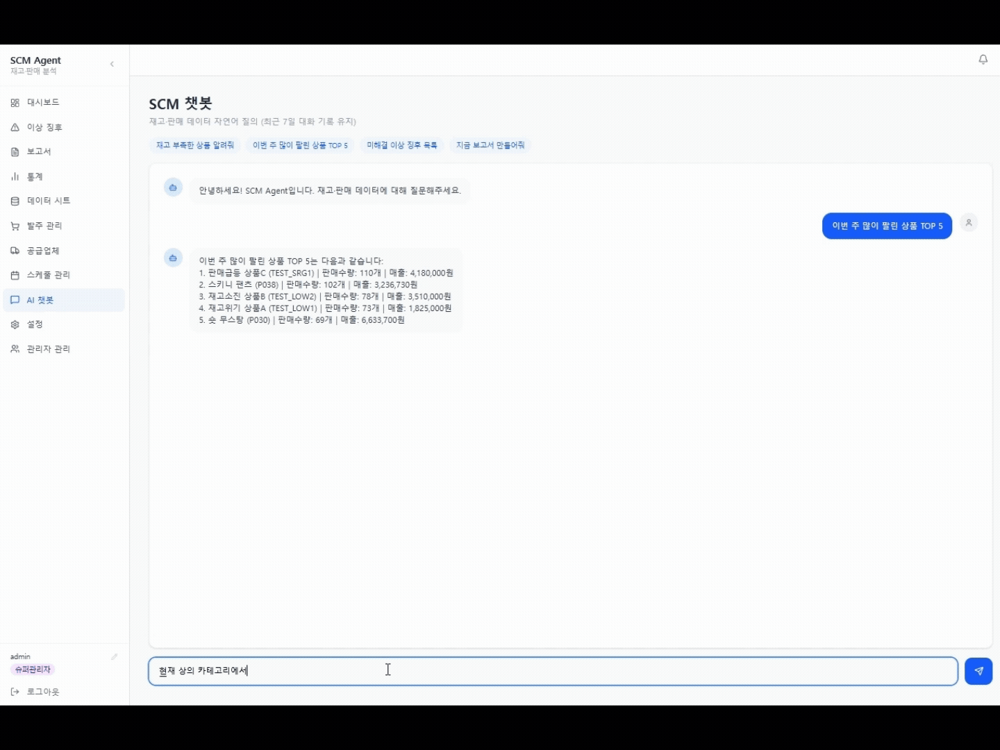
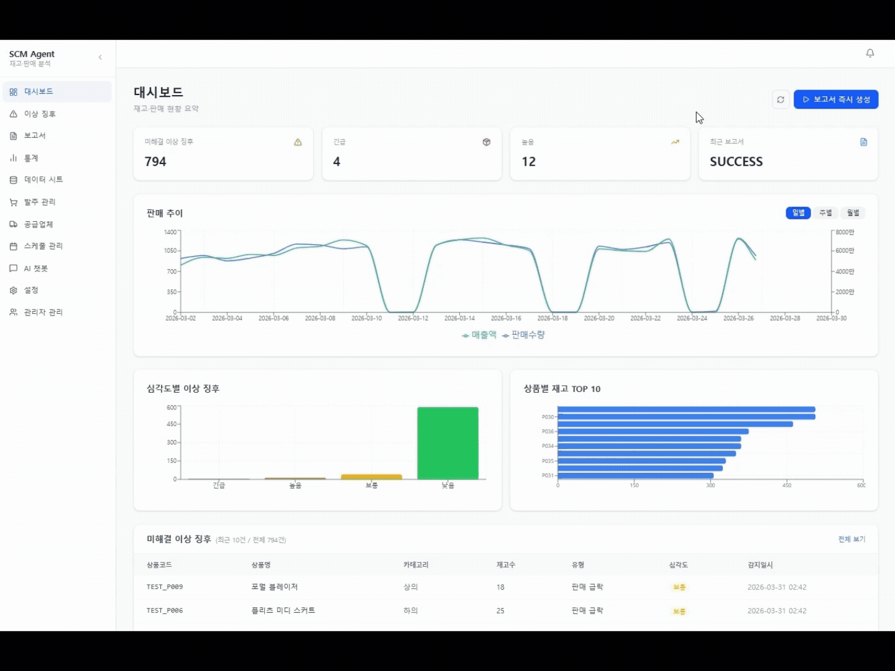
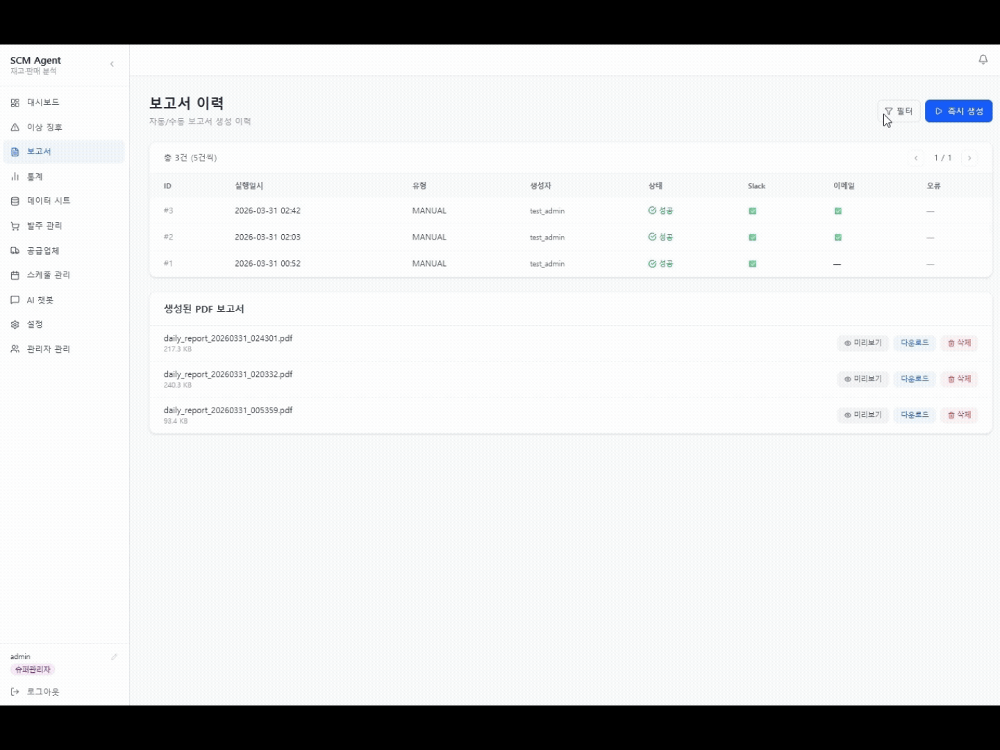
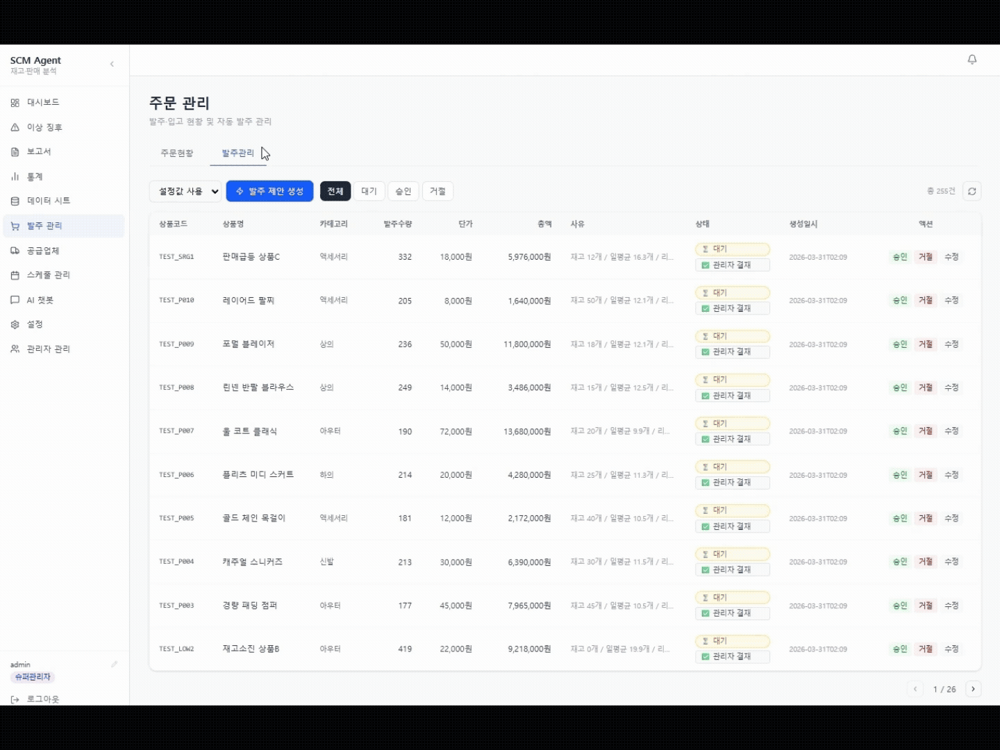

# SCM Agent

**쇼핑몰 공급망 자동화 에이전트** — 재고 이상 탐지부터 AI 발주 처리, 보고서 자동 생성까지 한 사이클로 자동화합니다.

[](https://www.python.org/)
[](https://fastapi.tiangolo.com/)
[](https://nextjs.org/)
[](https://docs.celeryq.dev/)
[](https://mariadb.org/)
[](/)
[](/)

> Google Sheets 재고·판매 데이터를 실시간 모니터링하고, AI가 이상징후를 탐지해 발주를 자동 처리하는 풀스택 SCM 에이전트입니다.
> Docker Compose 하나로 전체 시스템을 실행할 수 있습니다.

---

## 데모

### AI Agent 자율 발주 처리

자연어로 지시하면 Agent가 Tool을 직접 호출해 DB 상태를 변경합니다. 단순 조회 챗봇이 아닌 **Write Tool**이 동작하는 에이전트입니다.


```
입력: "재고 부족한 상품 전부 발주 처리해줘"
  → get_low_stock Tool 호출 → 재고 부족 상품 목록 조회
  → approve_anomaly_orders Tool 호출 → 발주 자동 생성 + 즉시 승인
  → Slack 발주 완료 알림 전송
```

---

### 이상징후 감지 → 자동 처리 전 사이클

이상 감지 → 원인 분석 → 발주 처리 → Slack 승인까지 한 화면에서 완결됩니다.



| 유형 | 조건 | 심각도 |
|------|------|--------|
| `LOW_STOCK` | 소진예상 1일 이하 | CRITICAL |
| `LOW_STOCK` | 소진예상 3일 이하 | HIGH |
| `LOW_STOCK` | 소진예상 7일 이하 | MEDIUM |
| `SALES_SURGE` | 전주 대비 +100% 이상 | CRITICAL |
| `SALES_SURGE` | 전주 대비 +70% 이상 | HIGH |
| `SALES_DROP` | 전주 대비 -50% 이하 | MEDIUM ~ CRITICAL |
| `OVER_STOCK` / `LONG_TERM_STOCK` | 과잉·장기 재고 | LOW |

---

###  보고서 즉시 생성 + Slack 자동 발송

심각도·카테고리 필터 적용 → HuggingFace 감성 분석 + GPT 인사이트 → PDF 생성 → Slack 발송까지 자동 파이프라인



---

### 발주 관리 — 총액 기준 자동 결재선 설정

총액에 따라 결재선이 자동 설정되고, Slack 인터랙션 버튼으로 승인/거절 처리가 가능합니다.



| 총액 기준 | 결재선 |
|-----------|--------|
| 10만원 미만 | 자동 승인 (SYSTEM) |
| 10만원 ~ 100만원 | 관리자 결재 (ADMIN) |
| 100만원 이상 | 최고관리자 결재 (SUPERADMIN) |

---

## 기술 스택

### 백엔드
| 기술 | 역할 |
|------|------|
| **FastAPI** | REST API, SSE 실시간 알림 |
| **Celery + RabbitMQ** | 비동기 태스크 큐 (분석·보고서·발주) |
| **Celery Beat** | 주기적 자동 실행 (동기화·이상징후 탐지) |
| **MariaDB** | 주 데이터 저장소 (SoT) |
| **Redis** | API 캐시, Celery result backend, 분산락 |
| **SQLAlchemy** | ORM |
| **pandas** | 재고·판매 데이터 분석 |
| **HuggingFace Transformers** | 판매 이상징후 감성 분석 |
| **xhtml2pdf** | PDF 보고서 렌더링 |
| **gspread** | Google Sheets API 연동 |

### 프론트엔드
| 기술 | 역할 |
|------|------|
| **Next.js 14** (App Router) | 관리자 대시보드 |
| **TypeScript** | 타입 안전성 |
| **React Query** | 서버 상태 관리·캐시 무효화 |
| **Recharts** | 판매·재고·이상징후 차트 |
| **Tailwind CSS** | UI 스타일링 |

### 인프라
```
Docker Compose
├── scm_agent          FastAPI API 서버 (:8000)
├── scm_admin          Next.js 대시보드 (:3001)
├── scm_celery_worker  Celery Worker
├── scm_celery_beat    Celery Beat 스케줄러
├── scm_db             MariaDB 11.3 (:3307)
├── scm_redis          Redis 7 (:6379)
└── scm_rabbitmq       RabbitMQ 3.12 (:5672 / 관리 :15672)
```

---

## 아키텍처
```
Google Sheets
     │  gspread (양방향 동기화)
     ▼
┌─────────────────────────────────────────┐
│              FastAPI Server             │
│                                         │
│  Router → Service Layer → Repository   │
│     ↓                                   │
│  SSE 실시간 알림 (이상징후·보고서 완료)    │
└────────────────┬────────────────────────┘
                 │ Celery Task
        ┌────────▼────────┐
        │  RabbitMQ Queue │
        │  Celery Worker  │◄── Beat (주기 스케줄)
        └────────┬────────┘
                 │
     ┌───────────┼───────────┐
     ▼           ▼           ▼
  MariaDB      Redis       Slack / Email
  (SoT)     (캐시·락)      (알림 발송)
```

---

## 주요 설계 포인트

### MariaDB SoT 전환
Google Sheets를 직접 SoT로 사용하면 API 레이트 리밋·데이터 일관성 문제가 발생합니다. MariaDB를 SoT로 전환하고 Sheets는 입력 인터페이스로만 활용합니다. DB ↔ Sheets 양방향 동기화로 양쪽 데이터를 동기화 상태로 유지합니다.

### 이중 캐시 전략
Redis(TTL 120분) + MariaDB `analysis_cache` 2계층 캐시를 구성합니다. Redis miss 시 DB에서 워밍업하고, 동기화 완료 시 분석 캐시를 자동 무효화합니다. 분석 태스크가 캐시 히트로 즉시 반환되므로 반복 호출 비용이 없습니다.

### Celery 분산락
Beat 주기 동기화와 수동 트리거가 동시에 실행되는 race condition을 Redis 분산락(`SET NX EX`)으로 방지합니다. 이미 동기화가 실행 중이면 후발 태스크는 즉시 skip 처리됩니다.

### InnoDB REPEATABLE READ 활용
보고서 생성(~15초)과 동기화가 동시에 실행될 때, InnoDB의 REPEATABLE READ 격리 수준으로 보고서가 시작 시점 스냅샷 기준으로 일관성 있게 생성됩니다. 별도의 트랜잭션 잠금 없이 데이터 일관성을 보장합니다.

### upsert 중복 방지
이상징후 upsert 시 날짜 기반이 아닌 `product_code + anomaly_type + is_resolved=False` 상태 기반 유니크 키를 사용합니다. 같은 이상징후가 반복 감지돼도 중복 insert 없이 기존 레코드를 업데이트합니다.

---

## 빠른 시작

### 1. 저장소 클론
```bash
git clone https://github.com/your-repo/scm-agent.git
cd scm-agent
```

### 2. 환경 변수 설정
```bash
cp .env.example .env
```

`.env` 필수 항목:
```env
# Google Sheets
GOOGLE_CREDENTIALS_JSON={"type":"service_account",...}
SPREADSHEET_ID=your_spreadsheet_id

# Slack
SLACK_BOT_TOKEN=xoxb-...
SLACK_CHANNEL_ID=C...

# DB
MARIADB_ROOT_PASSWORD=yourpassword
MARIADB_DATABASE=scm_db

# AI (선택 — 없으면 인사이트 생성 스킵)
OPENAI_API_KEY=sk-...

# 이메일 (선택)
SMTP_HOST=smtp.gmail.com
SMTP_USER=...
ALERT_EMAIL_TO=admin@example.com
```

### 3. 실행
```bash
docker-compose up -d
```

### 4. 접속

| 서비스 | 주소 |
|--------|------|
| 관리자 대시보드 | http://localhost:3001 |
| API 문서 (Swagger) | http://localhost:8000/docs |
| RabbitMQ 관리 | http://localhost:15672 |

### 5. 초기 데이터 동기화

대시보드 로그인 후 **스케줄 관리 → Sheets→DB 동기화 → 즉시 실행**

---

## 프로젝트 구조
```
app/
├── api/                FastAPI 라우터
├── services/           서비스 레이어
│   ├── sync_service.py      Sheets ↔ DB 동기화
│   ├── anomaly_service.py   이상징후 조회·자동처리
│   ├── order_service.py     발주 생성·승인·결재
│   ├── report_service.py    보고서 이력 관리
│   └── slack_service.py     Slack 메시지 발송
├── db/
│   ├── models.py       SQLAlchemy ORM (15개 테이블)
│   ├── repository.py   CRUD 함수
│   └── sync.py         bulk upsert (ON DUPLICATE KEY UPDATE)
├── analyzer/
│   ├── stock_analyzer.py     재고 이상징후 탐지
│   ├── sales_analyzer.py     판매 급등·급락 탐지
│   ├── demand_forecaster.py  수요 예측 (MA7 기반)
│   ├── abc_analyzer.py       ABC 등급 분석
│   └── turnover_analyzer.py  재고 회전율 분석
├── ai/
│   ├── anomaly_detector.py   이상징후 AI 종합 탐지
│   ├── order_agent.py        발주 수량 제안 생성
│   └── sentiment_analyzer.py HuggingFace 감성 분석
├── celery_app/
│   └── tasks.py        분석·동기화·보고서·선제발주 태스크
├── scheduler/
│   └── jobs.py         보고서 생성 7단계 파이프라인
├── report/
│   ├── template.py     HTML 보고서 템플릿
│   └── pdf_generator.py xhtml2pdf 렌더링
└── sheets/
    ├── reader.py       Sheets 읽기 (Redis 캐시 + 재시도)
    └── writer.py       Sheets 쓰기 (threading.Lock)

admin/                  Next.js 14 App Router
└── app/dashboard/
    ├── page.tsx             대시보드 (KPI 카드·차트)
    ├── anomalies/           이상징후 목록·자동처리 모달
    ├── reports/             보고서 이력·PDF 미리보기
    ├── stats/               ABC·수요예측·회전율 통계
    ├── sheets/              원본 데이터 조회
    ├── orders/              발주 관리·결재
    ├── chat/                AI 챗봇 (Tool Use Agent)
    └── settings/            시스템 설정·카테고리 리드타임

tests/                  pytest 통합 테스트
```

---

## 테스트
```bash
# 전체 테스트 (MariaDB 없이 SQLite in-memory로 실행)
pytest

# 커버리지 리포트
pytest --cov=app --cov-report=term-missing
```
```
134 passed · Coverage 51%
SQLite in-memory + StaticPool — 외부 DB 없이 CI 실행 가능
```

---

## 성과

| 지표 | 수치 |
|------|------|
| 통합 테스트 | 134 passed |
| 코드 커버리지 | 51% |
| API 응답 시간 (캐시 히트) | < 50ms |
| 보고서 생성 | ~15초 (PDF 렌더링 포함) |
| Sheets 동기화 | ~3초 (1000행 기준) |

---

## API 주요 엔드포인트

| Method | Endpoint | 설명 |
|--------|----------|------|
| `GET` | `/scm/anomalies` | 이상징후 목록 조회 |
| `POST` | `/scm/anomalies/{id}/auto-resolve` | 이상징후 자동 처리 |
| `POST` | `/scm/orders/generate` | 발주 제안 생성 |
| `PATCH` | `/scm/orders/{id}/approve` | 발주 승인 |
| `POST` | `/scm/reports/trigger` | 보고서 즉시 생성 |
| `GET` | `/scm/sheets/stats/demand` | 수요 예측 통계 |
| `GET` | `/scm/sheets/stats/abc` | ABC 분석 통계 |
| `POST` | `/scm/sheets/sync` | Sheets→DB 동기화 트리거 |
| `POST` | `/scm/chat` | AI 챗봇 (Tool Use) |

전체 API 명세: `http://localhost:8000/docs`

